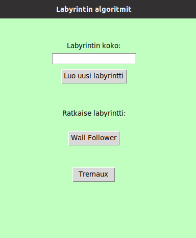
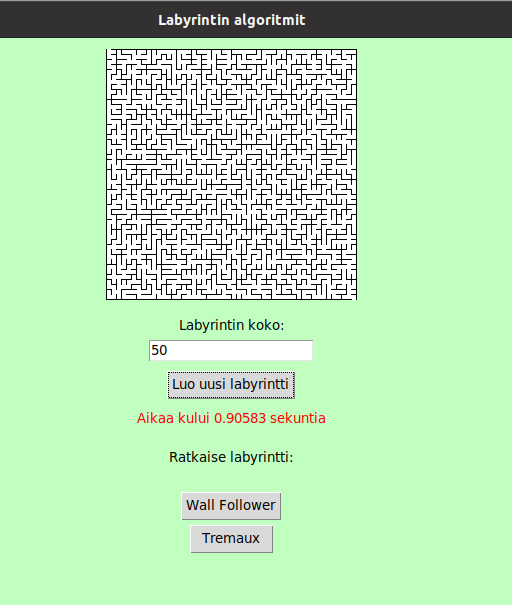
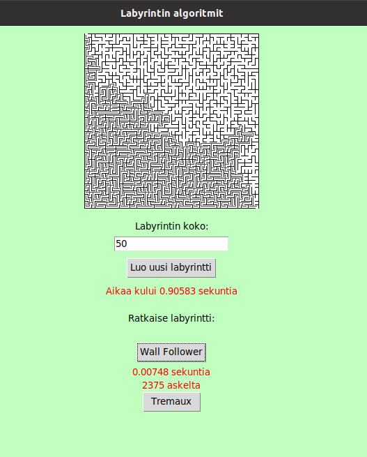
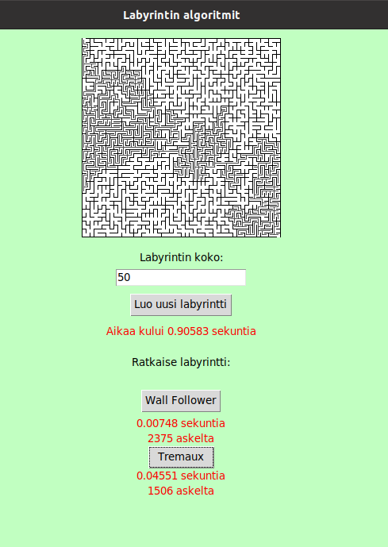

# Käyttöohje
Lataa viimeisimmän [releasen](https://github.com/JanneKarki/Algoritmien-vertailu-sovellus/releases/tag/Viikko_5) lähdekoodi valitsemalla Assets-osion alta Source code.


## Ohjelman käynnistäminen

Sovellus käyttää riippuvuuksien hallintaan poetrya, joten se tulee olla asennettuna koneelle.

Ennen sovelluksen käynnistämistä, suorita komentoriviltä sovelluksen juurihakemistossa seuraavat komennot:

1. Asenna sovelluksen tarvitsemat riippuvuudet komennolla:
```bash
poetry install
```

2. Käynnistä sovellus komennoilla:

```bash
poetry run invoke start
```

## Sovelluksen käyttäminen
### Alkunäkymä

Sovelluksen alkunäkymä.



### Labyrintin luonti
Labyrintin luonti tapahtuu syöttämällä kenttään labyrintin koko ja painamalla "Luo uusi labyrintti"-näppäintä. Syöte on neliön muotoisen labyrintin yhden sivun solujen määrä. 





Labyrintin luomisen jälkeen, sen kuva ilmestyy näkymään ja painikkeen alle algoritmilta sen muodostamiseen kulunut aika.


### Wall Follwer-ratkaisu

Kun labyrintti on luotu, niin sen voi ratkaista "Wall Follower"painikkeesta, seinää seurailevalla "Wall Follower"-algoritmilla.





Ratkaisun jälkeen, kuljettu reitti tulostuu kuvaan ja painikkeen alle ilmestyy "Wall Follower"-algoritmin suoritusaika ja kuluneiden asekelten määrä labyrintissa.

### Tremaux-ratkaisu

Saman labyrintin voi ratkaista myös "Tremaux"-algoritmilla, "Tremaux"-painikkeesta.



Jos kuvassa oli edellinen ratkaisu se poistuu ja tilalle tulee Tremaux-algoritmin ratkaisu. Myös Tremaux-painikkeen alle ilmestyy Tremaux-algoritmin suoritusaika ja kuluneiden askelten määrä labyrintissa. Tremaux-algoritmin ratkaisema reitti ei ole joka kerta sama sen satunnaisen reitin valinnan vuoksi, jolloin saman labyrintin voi koittaa ratkaista myös uudestaan.
