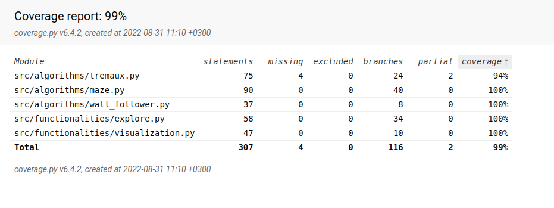
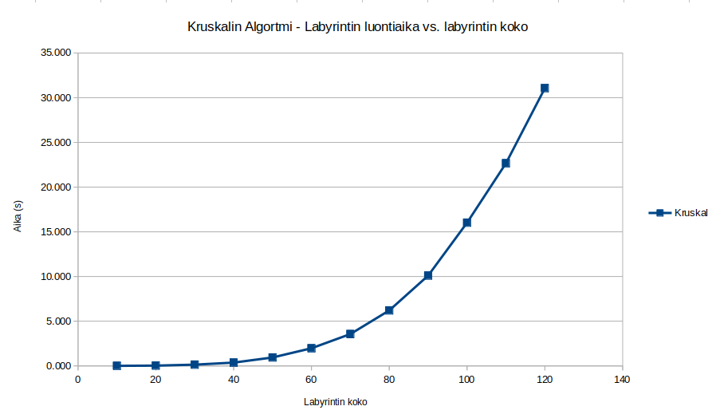
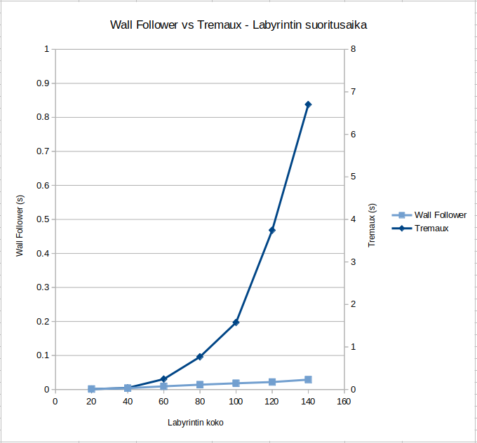
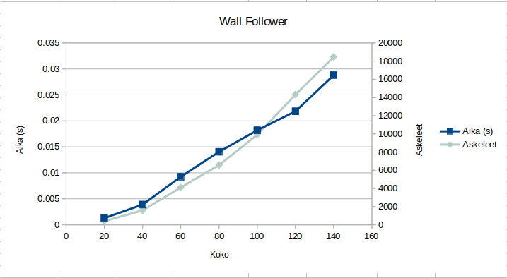
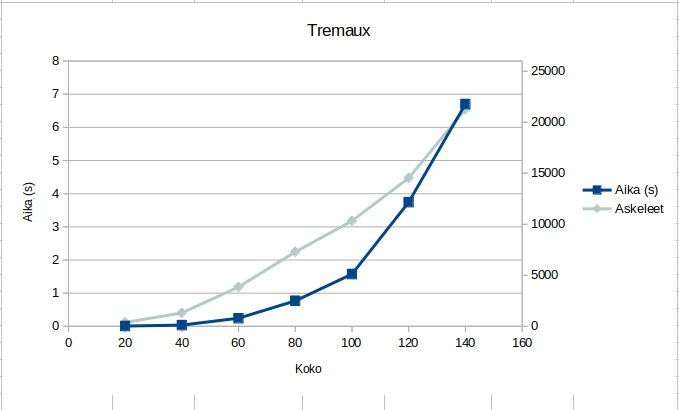
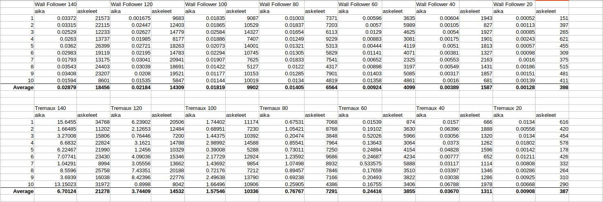

# Testausdokumentti

## Yksikkötestit

- [Visualization](https://github.com/JanneKarki/Algoritmien-vertailu-sovellus/blob/master/src/tests/visualization_test.py) - Labyrintin ja sen ratkaisun piirtämisestä vastaavan luokan testit.

- [Explorer](https://github.com/JanneKarki/Algoritmien-vertailu-sovellus/blob/master/src/tests/explore_test.py) - Labyrintissä algoritmien etenemisestä vastaavan luokan testit.

- [WallFollower](https://github.com/JanneKarki/Algoritmien-vertailu-sovellus/blob/master/src/tests/wall_follower_test.py) - algoritmista vastaavan luokan testit.

- [Tremaux](https://github.com/JanneKarki/Algoritmien-vertailu-sovellus/blob/master/src/tests/tremaux_test.py) - algoritmista vastaavan luokan testit.

- [Maze](https://github.com/JanneKarki/Algoritmien-vertailu-sovellus/blob/master/src/tests/maze_test.py) - Labyrintin luomisesta vastaavan luokan testit.

### Testien kattavuus

- UI-käyttöliittymäluokka on jätetty testien ulkopuolelle.

# Suorituskykytestit

### Kruskalin algoritmi

Labyrintin luomisessa käytettävän Kruskalin-algoritmin suorituskykyä testattiin eri kokoisillla syötteillä.

Kulunut aika kasvaa logaritmisesti ja jo yli 100 kokoiset labyrintit alkavat olla todella raskaita algoritmille rakentaa. Yli 130 kokoiset ovat jo algoritmille liian suuria ja luonti päättyy RecursionError-virheeseen.

## Labyrintin ratkaisualgoritmien testit

### Wall Follower vs Tremaux

Wall-Follower suoritui ratkaisusta huomattavasti nopeammin kaikilla syötteillä ja niiden vertailu vaati samaan kuvaajaan erilliset aika-akselit. Kuvaajassa vasemmalla on Wall-Followerin aika-akseli ja oikealla Tremauxin.

### Wall Follower

Wall-Follower-algoritmin suoritusaika kasvaa lineaarisesti labyrintin koon kasvaessa.

### Treamux
Tremauxi-algoritmin suoritusaika kasvaa logaritmisesti labyrintin koon kasvaessa.

## Testitulokset taulukossa

Suuren hajonnan vuoksi, Wallfollower- ja Tremaux-algoritmeja verrattiin keskenään erikokoisilla labyrinteillä suorittamalla molemmilla kymmenen toistoa ja vertailemalla niiden keskiarvoja. 

